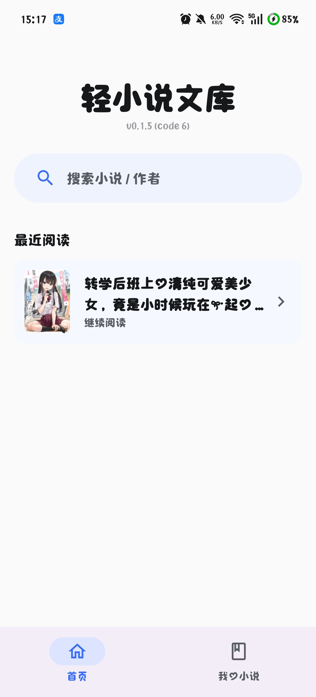
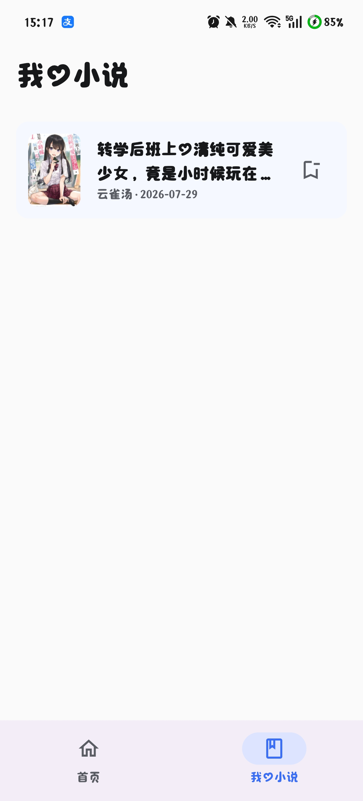
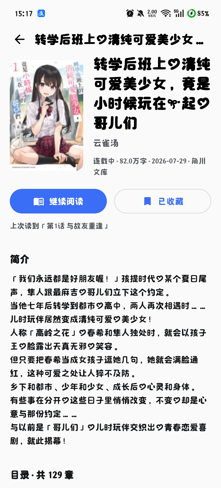
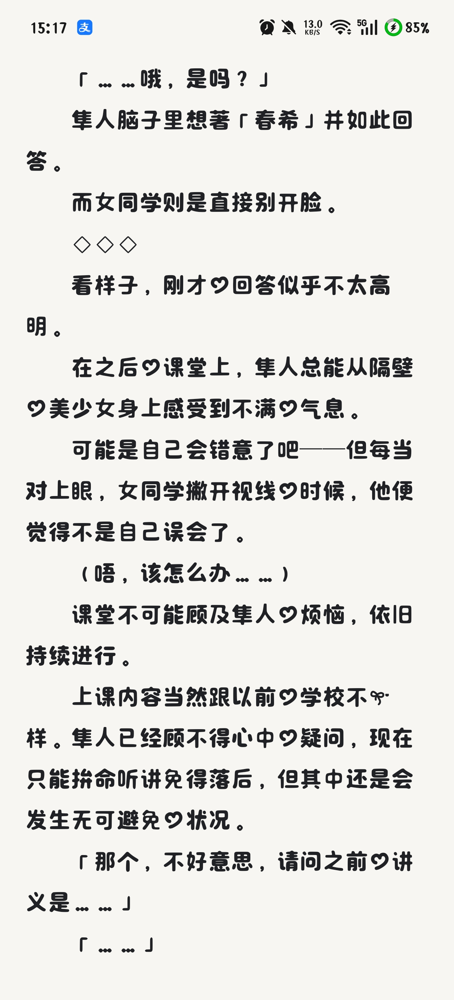

# 轻小说文库阅读器（wenku8-reader）

一款面向轻小说阅读的 Android 应用 —— 数据来自 wenku8，支持搜索、收藏、阅读、书签与自动续读。基于 Jetpack Compose 与 MVVM 全新实现，界面简洁、动效流畅。

> ⚠️ 本项目参考 [MewX/light-novel-library_Wenku8_Android](https://github.com/MewX/light-novel-library_Wenku8_Android) 独立重写，仅与 wenku8 的公开接口互通。数据来源为 wenku8，仅供学习交流，请勿用于商业用途。

## ✨ 功能特性

- 🔍 **搜索小说**：支持按书名搜索，保留历史搜索记录（可单条删除或清空）
- 📚 **小说详情**：封面、元数据（作者 / 状态 / 字数 / 更新时间）、简介与完整的卷章目录
- ⭐ **本地收藏（我的小说）**：无需账号，收藏信息保存在本地；收藏列表支持左滑取消收藏（二次确认）
- 📖 **沉浸式阅读器**：
  - 左右点击翻页 + 章末自动接续下一章
  - 正文插图自动加载
  - **四种阅读背景**（白天 / 夜间 / 羊皮纸 / 护眼绿），切换带颜色过渡动画
  - 字号、行距可调，支持电纸书模式（关闭动画）
  - 唤出式工具栏，阅读时不遮挡内容
- 📍 **页级阅读进度**：以「章节 + 段落 + 字符偏移」作为稳定锚点（页码是渲染产物，不落库），旋转屏幕或调整字号后均可准确恢复；首页「最近阅读」一键续读，支持左滑删除记录（二次确认）
- 🔖 **书签**：可自定义书签名与备注，按小说分组，点击即可跳转
- 🎨 跟随系统明暗模式，冷青色调品牌色，配以细腻的进入与过渡动效
- 🛠️ 内置**开发者日志页**（双击首页标题进入），无需连接调试环境即可排查网络与解析问题

## 📱 界面一览

| 首页（搜索 + 最近阅读）     | 我的小说（本地收藏卡片）            |
|:-----------------:|:-----------------------:|
|  |  |

| 小说详情（信息 + 章节树）          | 阅读器（沉浸翻页）                 |
|:-----------------------:|:-------------------------:|
|  |  |

## 🛠 技术栈

| 领域   | 技术                                      |
| ---- | --------------------------------------- |
| UI   | Jetpack Compose + Material 3            |
| 架构   | MVVM + Repository 模式                    |
| 异步   | Kotlin Coroutines / Flow                |
| 依赖注入 | Hilt                                    |
| 本地存储 | Room（收藏/进度/书签/搜索历史）+ DataStore（偏好）      |
| 网络   | OkHttp（wenku8 自定义 Base64 协议）            |
| 图片   | Coil 加载正文插图；封面走自定义 `do=cover` 二进制接口 + 内存缓存 |
| 动效   | Compose Animation                      |
| 字体   | 阅读正文使用中文衬线（Noto Serif / 宋体系）            |

## 🏗 项目结构

```
wenku8-reader/
├── docs/
│   ├── DESIGN.md              # 设计基调规范（色彩/字体/动效/阅读器设计）
│   └── Wenku8API-接口文档.md  # wenku8 接口完整文档（已实测验证）
└── app/src/main/java/com/wenku8/reader/
    ├── core/
    │   ├── designsystem/      # 主题 token、通用组件、动效
    │   ├── util/              # 版本号、日志、安装器等工具
    │   └── data/              # WenkuApi(协议) + 更新检测 + Room + Repository + 偏好
    ├── feature/
    │   ├── home/              # 首页（搜索入口 + 最近阅读）
    │   ├── search/            # 搜索（历史 + 结果卡片）
    │   ├── detail/            # 详情（信息 + 章节树 + 收藏/阅读）
    │   ├── library/           # 我的小说（本地收藏）
    │   ├── reader/            # 阅读器（分页/翻页/进度/书签/设置）
    │   ├── update/            # 应用内更新（弹窗 / 下载 / 安装引导）
    │   └── debug/             # 开发者日志页
    └── ui/                    # 导航
```

## 🔌 数据源说明

数据来自 wenku8 的 Android 接口：

- **Base URL**：`http://app.wenku8.cn/android.php`（明文 HTTP，应用内已做网络安全配置放行）
- **协议**：`POST request = Base64(UTF-8("action=…&do=…"))`
- 已实测验证的端点与响应格式详见 [`docs/Wenku8API-接口文档.md`](docs/Wenku8API-接口文档.md)

> 已知限制：列表（排行/最新/文库）的旧接口已废弃，当前服务器仅网页端可用且需登录，故本应用以**搜索**为唯一发现入口。

## 🚀 构建

环境要求：

- JDK 17+
- Android SDK（compileSdk 36）
- Gradle 8.13（仓库自带 wrapper）

```bash
# 国内网络建议先在 ~/.gradle/init.gradle 配置阿里云 Maven 镜像
./gradlew :app:assembleDebug
# 产物：app/build/outputs/apk/debug/app-debug.apk
```

> 中国大陆网络下访问 Google Maven 较慢，本机可通过 `~/.gradle/init.gradle` 配置阿里云镜像加速。

## 📄 文档

- [`docs/DESIGN.md`](docs/DESIGN.md) — 设计基调（配色 / 字体 / 动效 / 阅读器规范）
- [`docs/Wenku8API-接口文档.md`](docs/Wenku8API-接口文档.md) — wenku8 接口完整文档（签名 / 请求 / 响应 / 错误码，全部实测）

## 📜 License

本项目代码基于 [GPL-3.0](LICENSE) 开源。本项目为独立重写，仅与 wenku8 公开协议互通，致谢 [MewX/light-novel-library_Wenku8_Android](https://github.com/MewX/light-novel-library_Wenku8_Android)（GPL-2.0）。**数据版权归 wenku8 及原作者所有**，仅供学习交流使用，请勿用于商业用途。
